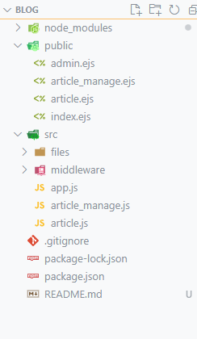

# Simple Personal Blog Project

This is a simple personal blog project implemented using Node.js and EJS as a templating engine. The project consists of two main sections: a **Guest Section** for public users and an **Admin Section** for managing articles.

---

## Features

### Guest Section

These pages can be accessed by anyone:

- **Home Page**: Displays a list of articles published on the blog.
- **Article Page**: Displays the content of an article along with its date of publication.

### Admin Section

These pages are accessible only to authorized users:

- **Dashboard**: Lists all published articles with options to add, edit, or delete articles.
- **Add Article Page**: Provides a form to add a new article with fields for the title, content, and date of publication.
- **Edit Article Page**: Provides a form to update the title, content, and date of publication for an existing article.

---

## Getting Started

### Prerequisites

- [Node.js](https://nodejs.org/) installed on your system.

### Installation

1. Clone the repository:
   ```bash
   git clone https://github.com/amrbadran/Simple-Personal-Blog.git
   cd Simple-Personal-Blog
   ```
2. Install dependencies:
   ```bash
   npm install
   ```
3. Run the server:
   ```bash
   npm start
   ```
4. Open your browser and navigate to `http://localhost:3000`.

---

## Project Structure



---

## Usage

### Adding Articles

1. Navigate to the **Admin Dashboard**.
2. Click on "Add Article" to create a new article.
3. Fill in the required fields (title, content, date of publication) and submit.

### Editing Articles

1. In the **Admin Dashboard**, locate the article to edit.
2. Click "Edit" to modify the article's details.
3. Update the fields as needed and save changes.

### Deleting Articles

1. In the **Admin Dashboard**, locate the article to delete.
2. Click "Delete" to remove the article from the blog.

---

## Authentication

- A simple login page is provided for the admin section (used Basic Auth HTTP).
- Credentials are hardcoded in the application for simplicity:
  - **Username**: `admin`
  - **Password**: `admin`

---

## Built With

- **Node.js**: Backend framework.
- **EJS**: Template rendering engine.
- **HTML/CSS**: Frontend structure and styling.

---
